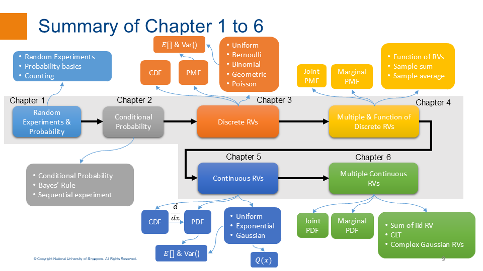

# EE2012-Tutorials-AY2526-Sem1
This repository is used for the EE2012 tutorials of AY2526 Sem1. 

A concise summary of **Chapters 1 to 6** is provided below. Detailed summaries for each individual chapter can be found at the beginning of their respective tutorial slides.

###  Please note that these slides are for reference only. Be sure to use the tutorial answers provided in Canva as your primary source. 

If you have any questions about the tutorials, feel free to contact Dr Feng LIN at feng_lin@nus.edu.sg

---

## How to download files from GitHub
Instructions on how to download files from GitHub can be found here: [Downloading files from GitHub](https://docs.github.com/en/get-started/start-your-journey/downloading-files-from-github). 

You can also use DownGit to download a subfolder from a GitHub repository:[https://downgit.github.io/#/home]

---

#  Best of luck to all of you on your exams! 
